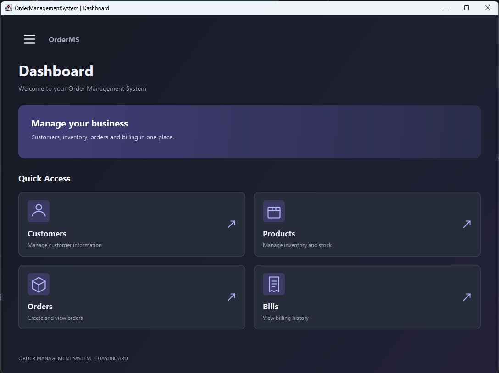
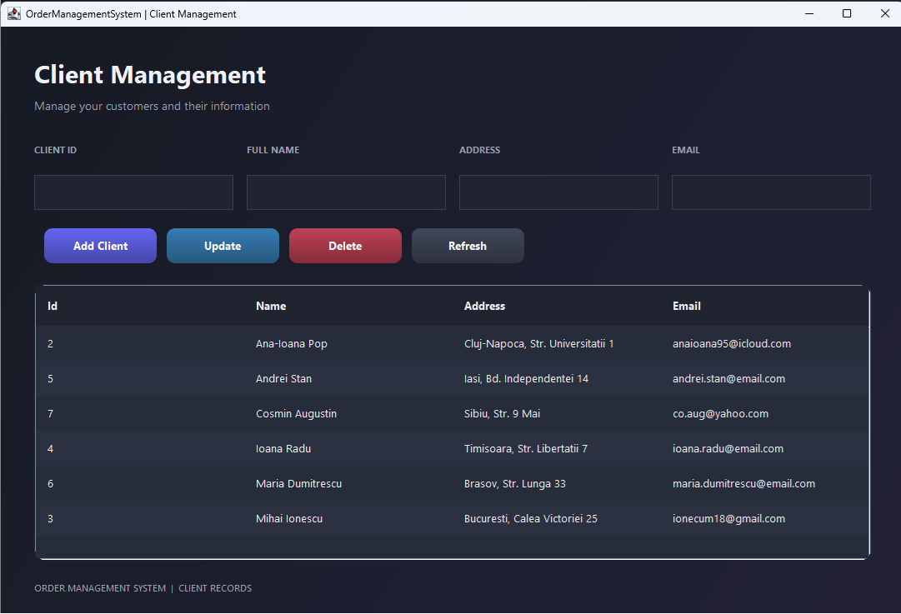
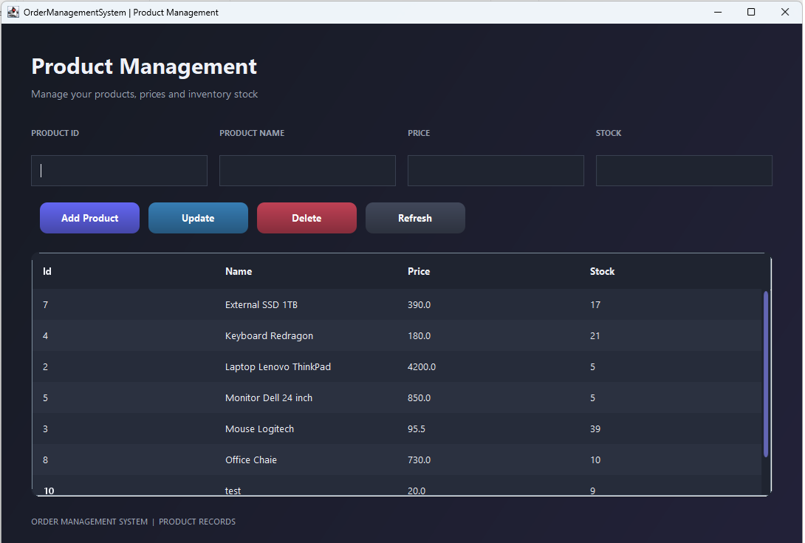
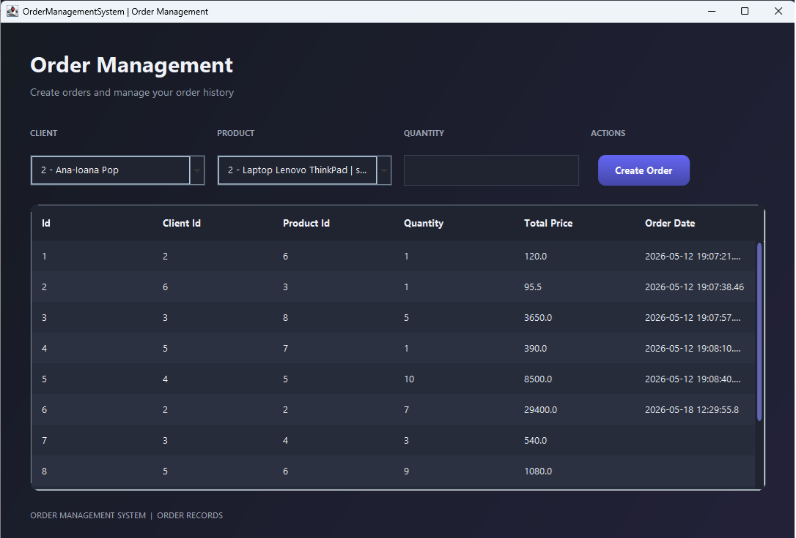
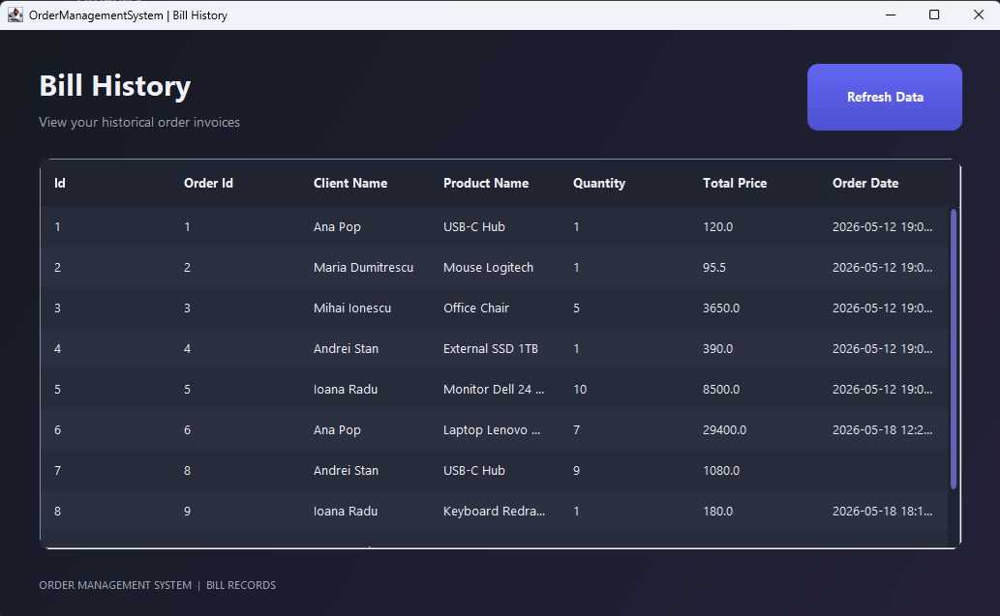

# Order Management System

A desktop application developed in **Java**, designed to manage customers, products, inventory, and orders through an intuitive graphical interface.

The project follows a **layered architecture**, separating business logic, data access, domain models, and presentation. It uses **Java Swing** for the graphical user interface, **Microsoft SQL Server** for data persistence, and **Java Reflection** for dynamically generating table models.

## Features

### Customer Management
- Add new customers
- Update existing customer information
- Delete customer records
- View customers in a sortable table

### Product & Inventory Management
- Add, update, and delete products
- Manage product prices and stock quantities
- View available inventory
- Track stock changes resulting from orders

### Order Processing
- Select a customer and an available product
- Specify the desired quantity
- Validate order requests and stock availability
- Create orders and update inventory
- View existing orders

### Billing History
- View generated billing records
- Display historical invoices in a read-only table
- Refresh billing data

### User Interface
- Modern dark-themed dashboard
- Collapsible sidebar navigation
- Interactive navigation cards
- Rounded controls and custom-styled tables
- Consistent design across application windows

## Technologies Used

| Technology | Purpose |
|---|---|
| Java | Core application development |
| Java Swing | Desktop graphical user interface |
| Microsoft SQL Server | Relational database |
| JDBC | Database connectivity |
| Maven | Dependency management and build |
| Java Reflection | Dynamic table generation |

## Architecture

The application follows a layered architecture:

```text
src/main/java/com/pt/
├── presentation/
│   ├── MainFrame.java
│   ├── ClientFrame.java
│   ├── ProductFrame.java
│   ├── OrderFrame.java
│   ├── BillFrame.java
│   └── ReflectionTableModel.java
├── businessLayer/
├── dataAccessLayer/
├── model/
├── connection/
└── validator/
```

**Presentation Layer:** Handles user interaction and displays application data using Java Swing.

**Business Layer:** Implements application logic, validations, and business operations.

**Data Access Layer:** Performs database operations using DAO classes.

**Model Layer:** Defines the domain entities used throughout the application.

**Connection Layer:** Manages database connectivity.

**Validation Layer:** Provides input and business-rule validation.

## Screenshots

### Main Dashboard



### Customer Management



### Product Management



### Order Management



### Billing History



## Getting Started

### Prerequisites

- Java JDK
- Apache Maven
- Microsoft SQL Server
- A Java IDE such as IntelliJ IDEA

### Installation

1. Clone the repository:

   ```bash
   git clone https://github.com/popanaioana/OrderManagementSystem.git
   ```

2. Open the project in IntelliJ IDEA.

3. Configure a SQL Server database using the project's database scripts, if provided.

4. Set the following environment variables in your run configuration:

   ```text
   DB_URL=your_jdbc_connection_url
   DB_USER=your_database_username
   DB_PASSWORD=your_database_password
   ```

5. Build the project:

   ```bash
   mvn clean package
   ```

6. Run the application's main entry point from your IDE.

## Implementation Highlights

- Layered architecture for separation of concerns
- Generic DAO implementation for reusable database operations
- Java Reflection for dynamic table rendering
- Business-layer validation
- Stock-aware order processing
- Custom Java Swing components and rendering

## Author

Developed by [Ana-Ioana Pop](https://github.com/popanaioana) as a Java desktop application project.